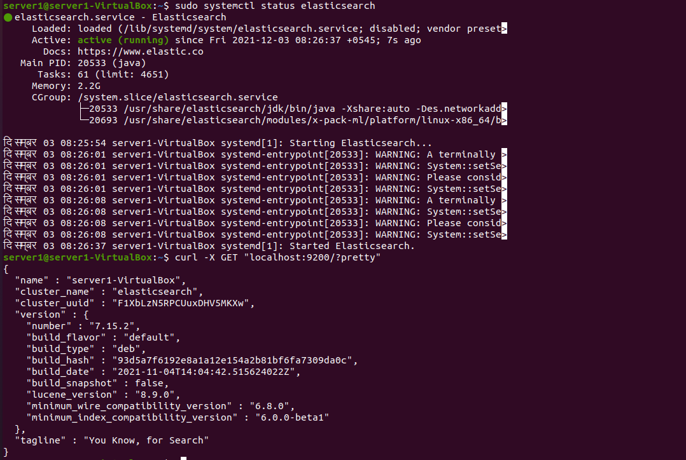

# ElasticSearch

## Q.1.

1.1 Install and enable elasticsearch on server 1

```bash
wget -qO - https://artifacts.elastic.co/GPG-KEY-elasticsearch | sudo apt-key add -
sudo apt-get install apt-transport-https
echo "deb https://artifacts.elastic.co/packages/7.x/apt stable main" | sudo tee /etc/apt/sources.list.d/elastic-7.x.list
sudo apt-get update && sudo apt-get install elasticsearch
sudo /bin/systemctl daemon-reload
sudo /bin/systemctl enable elasticsearch.service
```

1.2 Verify elastic search is working

Issue the following command using curl to verify that elastic search is working

```bash
curl -X GET "localhost:9200/?pretty"
```

Since in development mode the cluster would be bootstrapped automatically we don't need to configure cluster specific settings.



1.3 Install kibana

```bash
	apt-get install kibana   # pgp key already imported, also repository was added above
```

1.4 Configure basic authentication and expose node on the network

First stop `elasticsearch` and `kibana` service.

1.4.1 Enable xpack and expose node

Insert/Modify the following lines in `/etc/elasticsearch/elasticsearch.yml`

```bash
network.host: 192.168.0.7     # for exposing the node on the network
xpack.security.enabled: true
discovery.type: single-node
xpack.security.authc.api_key.enabled: true
```

1.4.2 Create password for builtin users

```bash
sudo systemctl start elasticsearch
./bin/elasticsearch-setup-passwords interactive
```


Check that Basic authentication is working


1.4.3 Configure Kibana with username and password

   Insert/Modify the following lines inside `/etc/kibana/kibana/yml`

```bash
# you should add username and password to the keystore and then import here from the 
#keystore for production use case.elasticsearch.username: "kibana_system"
elasticsearch.password: "kibana_system"
xpack.security.encryptionKey: "030975931421157894240340034655327875549024509551755699132442"
```


Access Kibana dashboard


1.5 Collect Memory usage, Disk usage, Load average in server2 and send them to elasticsearch. Store them in an index named "server2-metrics".

1.5.1 Install `metricbeat` on server2

```bash
curl -L -O https://artifacts.elastic.co/downloads/beats/metricbeat/metricbeat-7.15.2-amd64.deb
sudo dpkg -i metricbeat-7.15.2-amd64.deb
```


1.5.2 Configure `metricbeat` on server2

Open the file `/etc/metricbeat/metricbeat.yml` and insert/modify the following lines

```jsx
output.elasticsearch:
  hosts: ["192.168.0.7:9200"]
  username: "elastic"
  password: "elastic"
```


e


1.5.3 Create index named `server2-metric` 

1.5.4 Use `system` module in `metricbeat` for collecting memory usage, disk usage and load average


Insert/Modify `/etc/metricbeatl.yml` with following lines:

```bash
metricbeat.modules:
- module: system
  metricsets:
    - cpu             # for CPU usage
    - load            # for CPU load averages
    - diskio          # for disk io metrics 
    - filesystem      # for free disk space
  enabled: true
  period: 10s  
  cpu.metrics:  ["percentages","normalized_percentages"] 
  core.metrics: ["percentages"] 
  index: "server2-metric" 
```


## Q.2.

2.1 Create a dashboard in kibana, generate visual report(line graph) for Memory usage and load average of server2 with relation to time

Exploring index `server2-metric`


Created Dashboard


Dashboard with data


## Q.3.

3.1 Create alert when memory > 80% for last 2 minutes


3.2 Create alert when Disk usage > 70%


3.3 Create alert when load average >1 for last 2 minutes


Simulate CPU and Memory usage using `yes > /dev/null &`

High Load after applying stress


Alert in Slack

